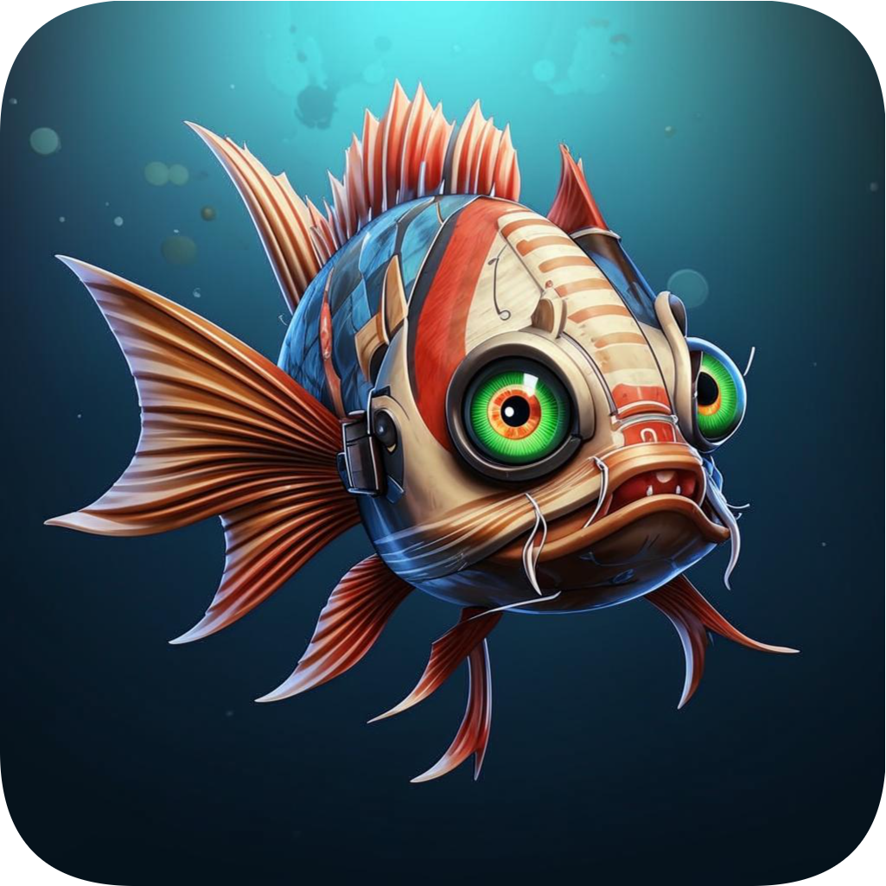

<div align="center">
  
  <h1 align="center"><b>Lophius</b></h1>
  <p align="center">🏭 A system for automating the collection, tracking, curation of media, and much more.</p>
</div>

<br>

<p align="center">
  <a href="./"></a>
</p>

<p align="center">
  <a href="http://www.gnu.org/licenses/agpl-3.0" rel="nofollow"></a>
  <a href="./"></a>
  <a href="./"></a>
</p>

<p align="center">
  <a href="https://lophius.ru">Demo</a>
  <span>&nbsp;•&nbsp;</span>
  <a href="#run-locally">Run Locally</a>
  <span>&nbsp;•&nbsp;</span>
  <a href="#authors">Authors</a>
  <span>&nbsp;•&nbsp;</span>
  <a href="#roadmap">Roadmap</a>
</p>

## Demo

You can view the demo version at [lophius.ru](https://lophius.ru)


## Run Locally

1. Clone the repository

```bash
  git clone https://github.com/zamelane/lophius
```

2. Navigate to the project server directory

```bash
  cd lophius/apps/web
```

3. Install dependencies

```bash
  bun i
```

4. Fill in the configuration file `.env` (see `.env.example` for an example)

5. Build and start the server (production)

```bash
  bun run build
  bun start
```


## Authors

- [@zamelane](https://www.github.com/zamelane)


## Roadmap

- Development plans for the project (step-by-step):
- Implement manual media editors
- Integrate external services for metadata extraction
- Implement the creation of collections and lists
- Add media tracking functionality (receiving notifications)
- Integrate a media release calendar
- Refactoring
